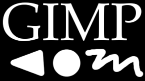
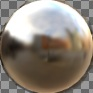
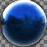
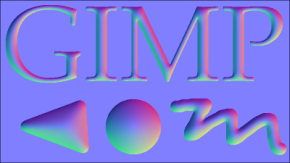
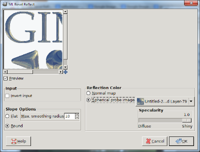

# ML Bevel Reflect - GIMP Plugin
Version: 2013-03-10

***WARNING: This is for Gimp 2.8, i.e., completely outdated.***

## Overview and Examples
Example output (plus a drop shadow effect):

### Input images:

### Other probe input and result:

Normal map output example: 

<h2>Installation / Compilation</h2>

This plugin is compatible with GIMP 2.8 (and should be with any 2.x version I guess).

So far there is only a Windows precompiled binary: <a href="MLBevelReflect-win-2013-03-10.zip">MLBevelReflect-win-2013-03-10.zip (176 KB)</a> 
Compiling yourself should not be hard on other platforms, it is a single .c file: <a href="https://github.com/vaifrax/MLBevelReflect">source code on github</a> 
To install, just copy the binary in the <i>gimp/plug-ins</i> folder.

<h2>Usage</h2>

With an RGB or RGBA image with white foreground objects on a black background, call <i>'filters/Map/MLBevelReflect'</i>.

<b>Invert input</b> For convenience: enable when you have an input image with black on white.

<b>Slope Options</b> 
 <i>Flat</i> is more like a 45 degree slope. The shape in the center is determined by the max. smoothing radius setting. You can use 1 pixel wide anti aliased foreground objects. 
 <i>Round</i> leads to a very smooth surface. Attention: Thick/wide objects currently take a very long time to compute!

<b>Reflection Color</b> 
 <i>Normal</i> map encodes the normal direction in RGB as commonly used by other programs. 
 A <i>spherical probe image</i> can be used as an environment map. The top left pixel is used for the background of the resulting image. If you want to use the alpha channel, both the input image as well as the probe image must be in RGBA.

<b>Specularity</b> 
 A diffuse reflection is an experimental option. At the moment it is probably better to manually blur the probe image yourself.

 You can resize the dialog to resize the preview.

<h2>Future Work / Known Restrictions</h2>

<ul>
 <li>White (foreground) objects touching the border will cause unwanted effects.</li>
 <li>Thick white objects take a very long time to compute for the round slope.</li>
 <li>Diffuse reflection does not really work very well.</li>
 <li>Output is not yet anti aliased.</li>
 <li>The reflection direction is a little bit off (not quite spherical).</li>
 <li>There are some artifacts for the flat slope, it is not very smooth.</li>
 <li>Convert to GEGL operations.</li>
</ul>

<h2>License / Donation</h2>

This plugin is free to use (released under the <a href="http://www.gnu.org/licenses/gpl.html">GPL</a>). However, you might consider a donation, especially if you make money with it.

